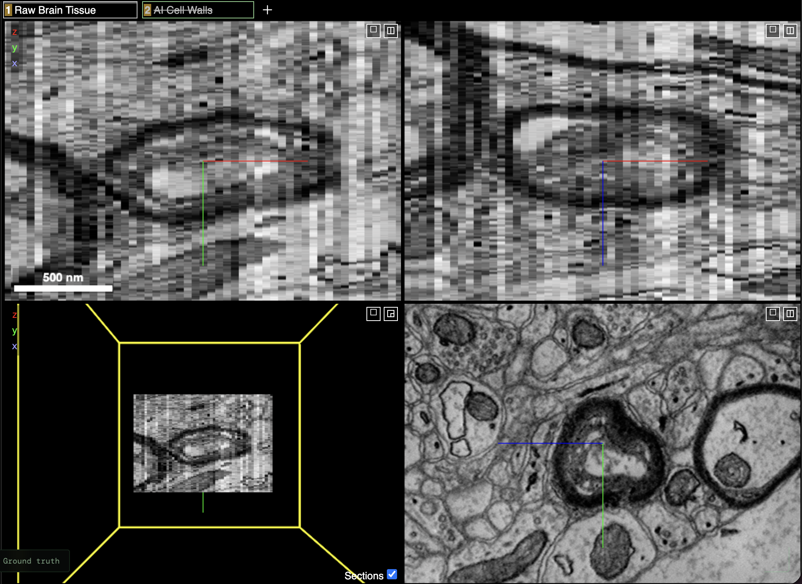
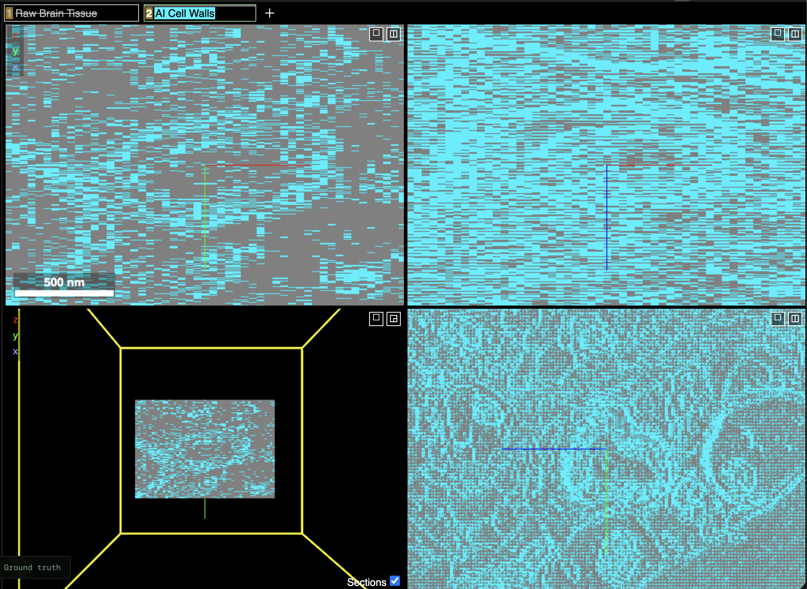
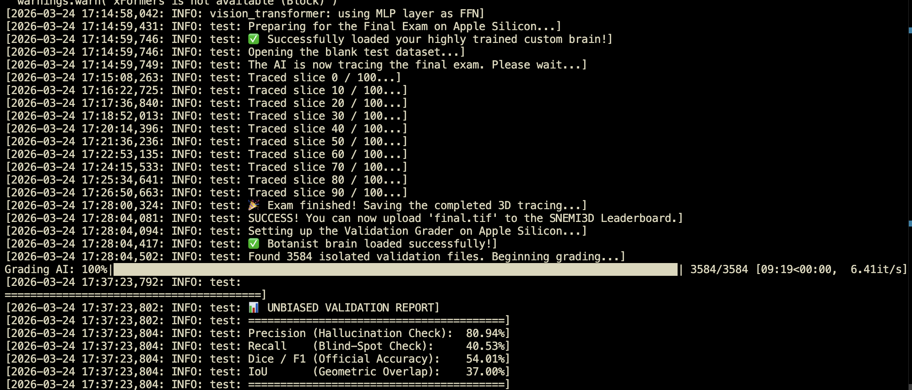
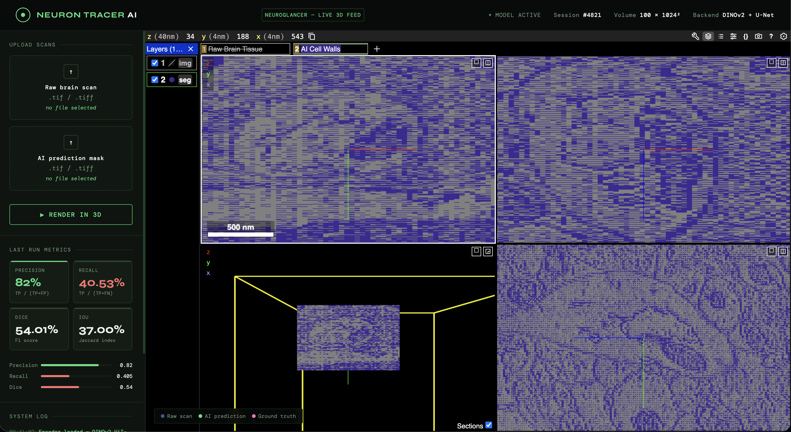

# 🧠 An automated 3D connectomics pipeline using DINOv2 to trace neural circuitry.


An end-to-end, enterprise-grade Machine Learning pipeline designed to solve 3D Connectomics. This project utilizes a hybrid **Frozen Vision Transformer (ViT)** and a **Custom Spatial U-Net** to automatically trace and segment complex neural boundaries in Electron Microscopy (EM) brain scans.

|---Demo---|
|-|
||

## 🌟 Key Features
* **Hybrid Encoder-Decoder:** Leverages Meta's DINOv2 as a frozen feature extractor, drastically reducing VRAM and training time.
* **Spatial Patch Extraction:** Bypasses standard 1D ViT `CLS` tokens to extract 2D topographic grids, preserving crucial biological geometry.
* **Dimensionality Bridging (The 21-Channel Fix):** Intelligently transposes 3D volumetric depth `[1, 7, 64, 64]` into high-speed 2D batches `[7, 1, 64, 64]` to bridge the gap between medical data and standard vision models.
* **High-Speed NumPy Grader:** Custom, memory-efficient evaluation script bypassing standard bulky libraries.
* **Interactive 3D Web Dashboard:** Integrated FastAPI and Google's Neuroglancer for real-time, WebGL-powered 3D visualization of the AI's predictions.

---

## 📖 Overview
**The Non-Technical Explanation:**
Mapping the brain's wiring (Connectomics) by hand takes humans thousands of hours. To automate this, we built a two-part AI system:
1. **The Satellite (Encoder):** We use Meta's world-class vision model to look at the microscopic tissue and highlight complex shapes, textures, and edges. 
2. **The Cartographer (Decoder):** We built a custom algorithm that looks at the Satellite's highlights and physically draws the final boundary lines around the brain cells. 

By letting the Satellite handle the "seeing," our Cartographer learns how to draw flawless maps in a fraction of the time.

---
|Raw Brain Tissue(Test)|AI predicted Cell wall|
|-|-|
|||
## 🏗️ Model Architecture
* **Backbone:** `dinov2_vitb14` (Frozen). Extracts $16 \times 16$ spatial patch tokens from bilinearly upsampled inputs.
* **Adapter:** Converts 1-channel grayscale EM patches to 3-channel pseudo-RGB to satisfy ViT constraints.
* **Decoder (The Botanist):** A 3-block Transposed Convolutional network with Batch Normalization and ReLU. 
* **Loss Function:** `BCEWithLogitsLoss`. By outputting raw math logits instead of utilizing a final `Sigmoid` layer, the model utilizes PyTorch's log-sum-exp trick to avoid vanishing gradients when the AI is unconfident.

---

## 🎯 Target Metrics
Because 95% of a brain scan is empty space, standard "Accuracy" is a flawed metric (the model could guess "empty space" everywhere and score a 95%). We evaluate true intelligence using geometric overlap:
* **Precision:** Measures hallucination rate. When the AI draws a wall, how often is it correct?
* **Recall:** Measures blind spots. Out of all the real walls, how many did the AI successfully find?
* **Dice Score (F1):** The ultimate harmonic mean, balancing Precision and Recall.
* **IoU (Intersection over Union):** The strict geometric overlap of the predicted pixels versus the human ground-truth pixels.

|Testing metrics|
|-|
||
---

## 📂 Project Repo Structure
```text
📦NeuronWireTracingEngine
 ┣ 📂config
 ┃ ┗ 📜config.yaml
 ┣ 📂frontend
 ┃ ┣ 📂static
 ┃ ┃ ┣ 📜home.css
 ┃ ┃ ┗ 📜main.js
 ┃ ┗ 📜index.html
 ┣ 📂logs
 ┃ ┗ 📜running_logs.log
 ┣ 📂model
 ┃ ┗ 📜dino_decoder_best.pth
 ┣ 📂output
 ┃ ┗ 📜final_submission.tif
 ┣ 📂research
 ┃ ┣ 📜01_data_ingestion.ipynb
 ┃ ┣ 📜02_5_torchconversion.ipynb
 ┃ ┣ 📜02_data_transform.ipynb
 ┃ ┣ 📜03_model_building.ipynb
 ┃ ┣ 📜04_model_training.ipynb
 ┃ ┗ 📜05_test.ipynb
 ┣ 📂src
 ┃ ┣ 📂neuronTracer
 ┃ ┃ ┣ 📂components
 ┃ ┃ ┃ ┣ 📜__init__.py
 ┃ ┃ ┃ ┣ 📜data_convert.py
 ┃ ┃ ┃ ┣ 📜data_ingestion.py
 ┃ ┃ ┃ ┣ 📜data_transform.py
 ┃ ┃ ┃ ┣ 📜model_build.py
 ┃ ┃ ┃ ┣ 📜model_diagnosis.py
 ┃ ┃ ┃ ┣ 📜model_train.py
 ┃ ┃ ┃ ┗ 📜test.py
 ┃ ┃ ┣ 📂config
 ┃ ┃ ┃ ┣ 📜__init__.py
 ┃ ┃ ┃ ┗ 📜configuration.py
 ┃ ┃ ┣ 📂constants
 ┃ ┃ ┃ ┗ 📜__init__.py
 ┃ ┃ ┣ 📂entity
 ┃ ┃ ┃ ┣ 📜__init__.py
 ┃ ┃ ┃ ┗ 📜config.py
 ┃ ┃ ┣ 📂pipeline
 ┃ ┃ ┃ ┣ 📜__init__.py
 ┃ ┃ ┃ ┣ 📜stage1.py
 ┃ ┃ ┃ ┣ 📜stage2.py
 ┃ ┃ ┃ ┣ 📜stage2_5.py
 ┃ ┃ ┃ ┣ 📜stage3.py
 ┃ ┃ ┃ ┣ 📜stage4.py
 ┃ ┃ ┃ ┣ 📜stage5.py
 ┃ ┃ ┃ ┗ 📜stage6.py
 ┃ ┃ ┣ 📂utils
 ┃ ┃ ┃ ┣ 📜__init__.py
 ┃ ┃ ┃ ┗ 📜common.py
 ┃ ┃ ┗ 📜__init__.py
 ┣ 📜.gitignore
 ┣ 📜.python-version
 ┣ 📜README.md
 ┣ 📜app.py
 ┣ 📜dvc.yaml
 ┣ 📜main.py
 ┣ 📜params.yaml
 ┣ 📜pyproject.toml
 ┣ 📜requirements.txt
 ┣ 📜setup.py
 ┣ 📜template.py
 ┗ 📜uv.lock
```

## ⚙️ Setup & Installation

### 1. Clone the repository

```bash
git clone [https://github.com/yourusername/Superhuman-Connectomics.git](https://github.com/yourusername/Superhuman-Connectomics.git)
cd Superhuman-Connectomics
```
### 2. Create a virtual environment & install dependencies

```Bash
python -m venv .venv
source .venv/bin/activate  # On Windows: .venv\Scripts\activate
pip install -r requirements.txt
```

## 🗄️ Data Version Control (DVC)
Because EM brain scans (`.tif`) are massive, they cannot be pushed to GitHub. We use DVC to track the data alongside the code.

### 1. Initialize DVC

```Bash
dvc init
```
### 2. Track the artifacts folder

```Bash
dvc add artifacts/
git add artifacts.dvc .gitignore
git commit -m "Track data with DVC"
```
## 🚀 Running the Pipeline
### 1. Split the Data for Validation
Automatically hold back 15% of your chunked data for unbiased grading.

```Bash
python split_data.py
```
### 2. Train the Model
Initiates the frozen ViT and trains the Spatial Decoder.
(Note: Includes the `labels == 0.0` binarization fix to handle `uint16` instance masks).

```Bash
python train_dino.py
```
### 3. Model Evaluation
Calculates Precision, Recall, Dice, and IoU on the unseen validation split.

``` Bash
python evaluate_validation.py
```
### 4. Generate Final Test Submission
Runs the AI over the unlabelled test block and outputs a 3D `.tif` mask.

```Bash
python run_dino_inference.py
```
## 🌐 Deployment: Interactive 3D Web App
Visualize the original biological tissue overlaid with the AI's neon boundary predictions in real-time.

### Boot up the FastAPI server:

```Bash
python app.py
Open your browser and navigate to: http://127.0.0.1:8000
```
||
|-|
Use the Control Panel to upload custom `.tif` scans and dynamically re-render the Neuroglancer 3D environment.